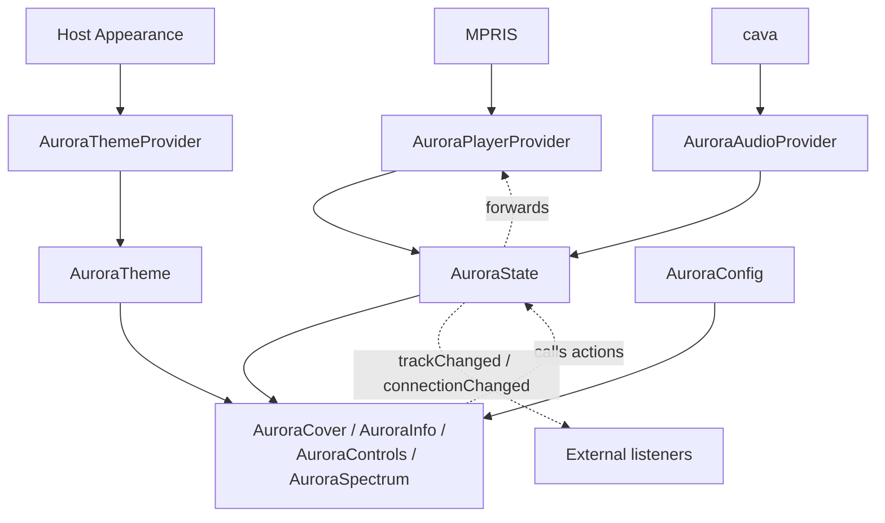

# Data flow

The formal version of `Research/MEDIAFLOW.md` - that file is "ii"'s
pattern as reference material. This is Aurora's own, as built.

## Reading it

**In (three independent lanes, one per Provider):**
`AuroraPlayerProvider` reads MPRIS metadata and transport state,
`AuroraAudioProvider` reads cava's spectrum output, `AuroraThemeProvider`
reads either the host's `Appearance` or Aurora's own bundled palette.
They never read each other and never share a lane - if one lane is
unavailable (no cava, host has no MPRIS player active) the other two
keep working normally.

**Rest (static, no lane):** `AuroraConfig` isn't written by anything -
it's read the same way at startup and at runtime.

**Out to components:** every visual component reads `AuroraState`,
`AuroraTheme` and `AuroraConfig` directly. Nothing here is push-based;
QML's property bindings mean a component just re-evaluates automatically
when the value it's bound to changes.

**Back up (actions):** `AuroraControls` and `AuroraInfo`'s scrubber don't
call `AuroraPlayerProvider` - they call `AuroraState.togglePlaying()` /
`.next()` / `.previous()` / `.seek()`, which forward. Same rule as
reading data: components only ever talk to `AuroraState`.

**Out to the rest of the world:** `AuroraState.trackChanged()` and
`.connectionChanged()` fire for anything outside Aurora that wants to
react to it - a host bar showing a mini "now playing" elsewhere, for
example - without that listener needing to diff individual property
changes itself.

## Why three Providers instead of one

Each is a single external dependency (MPRIS, cava, a host theme) that
can fail or be missing independently, without the diagram or the code
being different in shape. Losing cava shouldn't touch playback; losing
MPRIS shouldn't touch theming. One Provider per lane keeps that true
by construction rather than by discipline.
