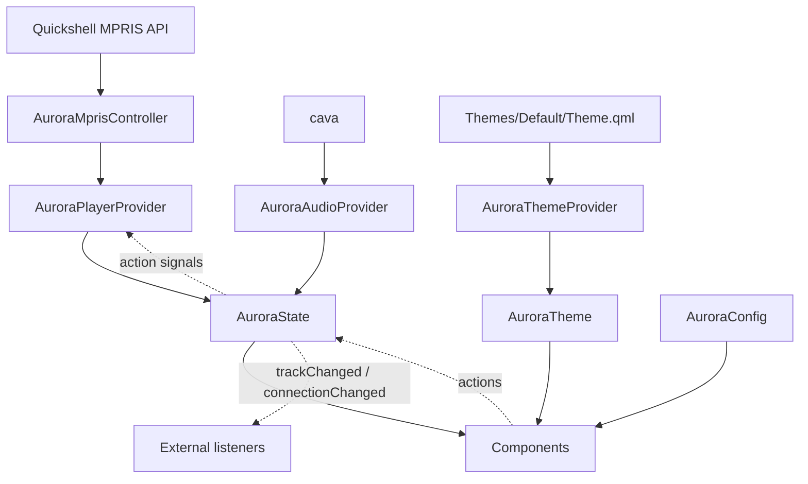

# Data flow

La versión formal del flujo de datos de Aurora. El material de `Research/` puede servir como referencia, pero el diagrama de este documento representa únicamente el runtime propio de Aurora.


```mermaid
flowchart TD
    MPRIS[Quickshell MPRIS API] --> MC[AuroraMprisController]
    MC --> PP[AuroraPlayerProvider]
    CAVA[cava] --> AP[AuroraAudioProvider]
    PALETTE[Themes/Default/Theme.qml] --> TP[AuroraThemeProvider]

    PP --> STATE[AuroraState]
    AP --> STATE
    TP --> THEME[AuroraTheme]

    STATE --> COMP[Components]
    THEME --> COMP
    CONFIG[AuroraConfig] --> COMP

    COMP -. actions .-> STATE
    STATE -. action signals .-> PP

    STATE -. trackChanged / connectionChanged .-> LISTENERS[External listeners]
```

## Lectura del flujo

**MPRIS:** `AuroraMprisController` es el adaptador de infraestructura sobre la API oficial `Quickshell.Services.Mpris`. `AuroraPlayerProvider` consume esa interfaz, resuelve el reproductor seleccionado, deduplica fuentes cuando corresponde y escribe datos planos en `AuroraState`.

**Audio:** `AuroraAudioProvider` ejecuta Cava cuando está disponible, procesa su salida y escribe `AuroraState.spectrumLevels`. Si Cava no está disponible o no hay muestras válidas, el estado puede quedar sin datos de espectro y `AuroraSpectrum` utiliza su fallback visual.

**Tema:** el runtime actual es standalone. `AuroraThemeProvider` carga `Themes/Default/Theme.qml` y escribe `AuroraTheme`. `themeSystem` existe como punto de extensión reservado; actualmente no conecta con un singleton de apariencia de un host.

**Configuración:** `AuroraConfig` contiene configuración interna de comportamiento y diseño. Los componentes la leen directamente; no existe un Provider intermedio para configuración estática.

**Componentes:** los componentes visuales leen `AuroraState`, `AuroraTheme` y `AuroraConfig`. No consumen directamente objetos MPRIS, procesos de Cava ni APIs de un host.

**Acciones:** los componentes emiten acciones mediante señales de `AuroraState`, por ejemplo `togglePlaying()`, `next()`, `previous()`, `seek()` y `selectPlayer()`. `AuroraPlayerProvider` escucha esas señales y actúa sobre el reproductor resuelto.

**Eventos:** `AuroraState.trackChanged()` y `connectionChanged()` permiten que listeners externos reaccionen a cambios de alto nivel sin depender de la secuencia interna de propiedades.

## Por qué existen Providers separados

Cada Provider encapsula una frontera externa diferente:

- MPRIS / reproductores multimedia.
- Cava / datos de audio.
- Fuente de tema standalone y futuros adapters de tema.
- EasyEffects / presets de ecualizador.

Una dependencia opcional puede desaparecer sin convertir su fallo en un fallo de toda la aplicación. La separación también evita que Components conozca detalles de infraestructura.

## Regla de dirección

```text
External APIs / processes
          ↓
      Providers
          ↓
     AuroraState
          ↓
      Components
```

El flujo de acciones recorre el camino inverso mediante señales:

```text
Components → AuroraState signals → Providers → external service
```

`Core` no importa `Providers`. El bootstrap controlado de `AuroraPlayer` es el único punto que inicializa Providers al cargar el widget.
